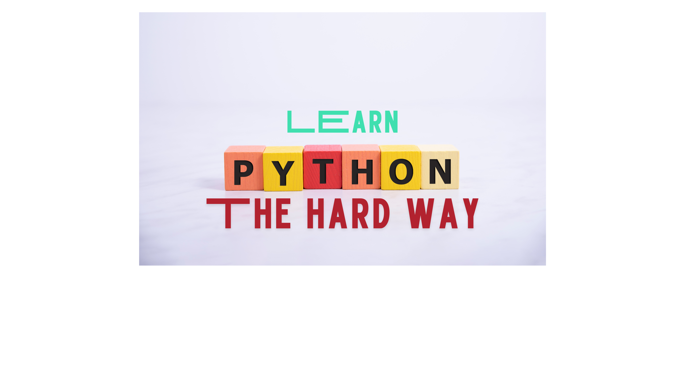

  

# Learn Python The Hard Way
Repo for the exercises  from the [Learn Python The Hard Way (5th Edition)](https://www.informit.com/store/learn-python-the-hard-way-9780138270575) book by Zed A. Shaw.

# Contents

### Module 1: Getting Started in Python 
- Exercise 0: Gearing Up
- Exercise 1: A Good First Program
- Exercise 2: Comments and Pound Characters
- Exercise 3: Numbers and Math
- Exercise 4: Variables and Names
- Exercise 5: More Variables and Printing
- Exercise 6: Strings and Text
- Exercise 7: Combining Strings
- Exercise 8: Formatting Strings Manually
- Exercise 9: Multi-Line Strings
- Exercise 10: Escape Codes in Strings
- Exercise 11: Asking People Questions
- Exercise 12: An Easier Way to Prompt
- Exercise 13: Parameters, Unpacking, Variables
- Exercise 14: Prompting and Passing
- Exercise 15: Reading Files
- Exercise 16: Reading and Writing Files
- Exercise 17: More Files

### Module 2: The Basics of Programming
- Exercise 18: Names, Variables, Code, Functions
- Exercise 19: Functions and Variables
- Exercise 20: Functions and Files
- Exercise 21: Functions Can Return Something
- Exercise 22: Strings, Bytes, and Character Encodings
- Exercise 23: Introductory Lists
- Exercise 24: Introductory Dictionaries
- Exercise 25: Dictionaries and Functions
- Exercise 26: Dictionaries and Modules
- Exercise 27: The Five Simple Rules to the Game of Code
- Exercise 28: Memorizing Logic
- Exercise 29: Boolean Practice
- Exercise 30: What If
- Exercise 31: Else and If
- Exercise 32: Making Decisions
- Exercise 33: Loops and Lists
- Exercise 34: While Loops
- Exercise 35: Branches and Functions
- Exercise 36: Designing and Debugging
- Exercise 37: Symbol Review

### Module 3: Applying What You Know
- Exercise 38: Beyond Jupyter for Windows
- Exercise 39: Beyond Jupyter for macOS/Linux
- Exercise 40: Advanced Developer Tools
- Exercise 41: A Project Skeleton
- Exercise 42: Doing Things to Lists
- Exercise 43: Doing Things to Dictionaries
- Exercise 44: From Dictionaries to Objects
- Exercise 45: Basic Object-Oriented Programming
- Exercise 46: Inheritance and Advanced OOP
- Exercise 47: Basic Object-Oriented Analysis and Design
- Exercise 48: Inheritance versus Composition
- Exercise 49: You Make a Game
- Exercise 50: Automated Testing

### Module 4: Python and Data Science
- Exercise 51: What Is Data Munging?
- Exercise 52: Scraping Data from the Web
- Exercise 53: Getting Data from APIs
- Exercise 54: Data Conversion with pandas
- Exercise 55: How to Read Documentation (Featuring pandas)
- Exercise 56: Using Only pandas
- Exercise 57: The SQL Crash Course
- Exercise 58: SQL Normalization
- Exercise 59: SQL Relationships
- Exercise 60: Advice from an Even Older Programmer

